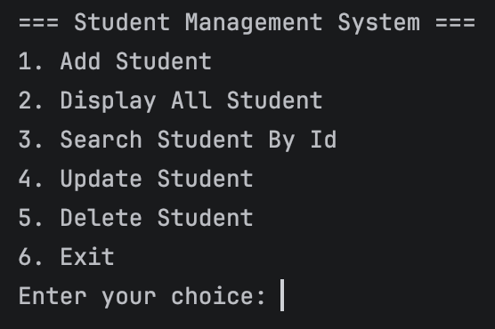
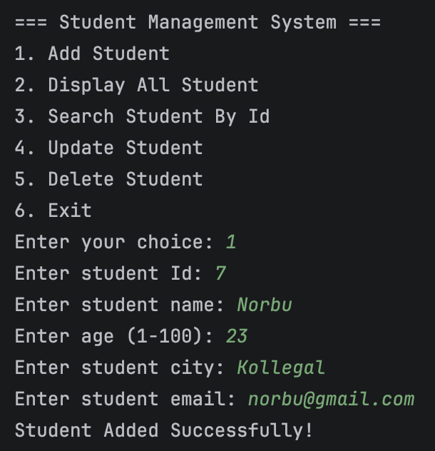
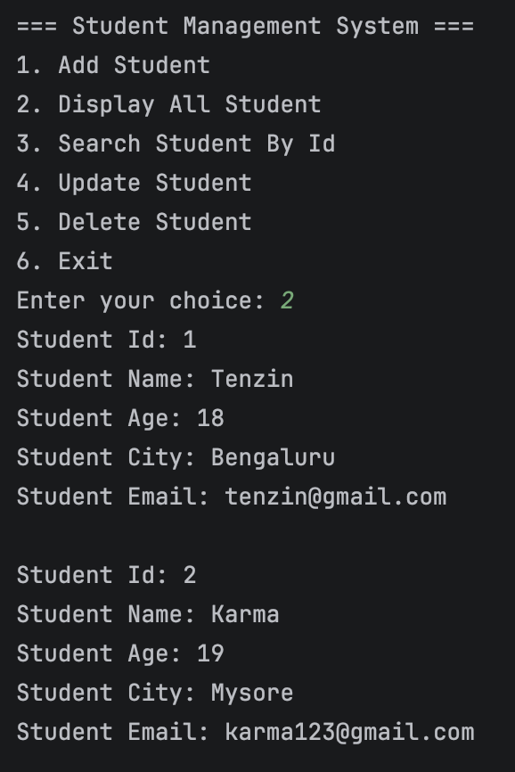
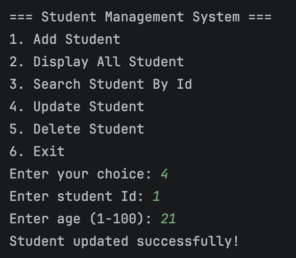
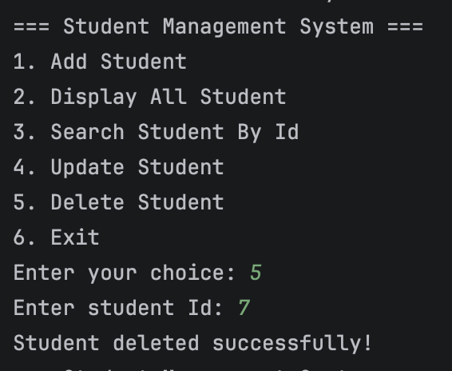
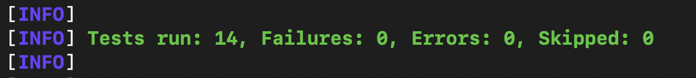

# Student Management System

A Java-based Student Management System built using JDBC and MySQL.

This project demonstrates basic CRUD operations, input validation, exception handling, and JUnit testing.

## Features

- Add student
- View all students
- Search student by ID
- Update student age
- Delete student
- Input validation
- Age validation
- Name validation
- Email validation
- Duplicate email handling
- Exception handling
- JUnit testing
- Maven project management

## Technologies Used

- Java 25
- JDBC
- MySQL
- Maven
- JUnit 5
- Git
- GitHub
- IntelliJ IDEA

## Database Setup

Create the database:

```sql
CREATE DATABASE student_management;
```

Select the database:

```sql
USE student_management;
```

Create the `students` table:

```sql
CREATE TABLE students (
    id INT PRIMARY KEY,
    name VARCHAR(100) NOT NULL,
    age INT NOT NULL,
    city VARCHAR(100),
    email VARCHAR(150) UNIQUE NOT NULL
);
```

## Configuration

The project uses environment variables for database credentials.

Set the following environment variables:

```text
DB_USER=your_username
DB_PASSWORD=your_password
```

The application uses:

```text
jdbc:mysql://localhost:3306/student_management
```

Do not commit your `.env` file or database password to GitHub.

## How to Run

1. Clone the repository.

```bash
git clone https://github.com/tennorbu16/StudentManagementSystem.git
```

2. Open the project in IntelliJ IDEA.

3. Make sure MySQL is running.

4. Create the `student_management` database and `students` table.

5. Configure the `DB_USER` and `DB_PASSWORD` environment variables.

6. Run the Maven tests:

```bash
mvn clean test
```

7. Run:

```text
LaunchApp.java
```

## Menu

```text
===== Student Management =====
1. Add Student
2. View All Students
3. Search Student by ID
4. Update Student
5. Delete Student
6. Exit
```

## Project Structure

```text
StudentManagementSystem/
├── src/
│   ├── main/
│   │   └── java/
│   │       └── com/tenzin/studentmanagement/
│   │           ├── JdbcUtil.java
│   │           ├── Student.java
│   │           ├── StudentDAO.java
│   │           ├── StudentValidator.java
│   │           └── LaunchApp.java
│   │
│   └── test/
│       └── java/
│           └── com/tenzin/studentmanagement/
│               ├── JdbcUtilTest.java
│               ├── StudentDAOTest.java
│               ├── StudentTest.java
│               └── StudentValidatorTest.java
│
├── .gitignore
├── pom.xml
└── README.md
```

## Testing

The project contains JUnit tests for:

- Student model
- Student validation
- Database connection
- Student DAO operations

Run all tests using:

```bash
mvn clean test
```

## Screenshots

### Main Menu



### Add Student



### View Students



### Update Student



### Delete Student



### JUnit Tests



## Author

Tenzin